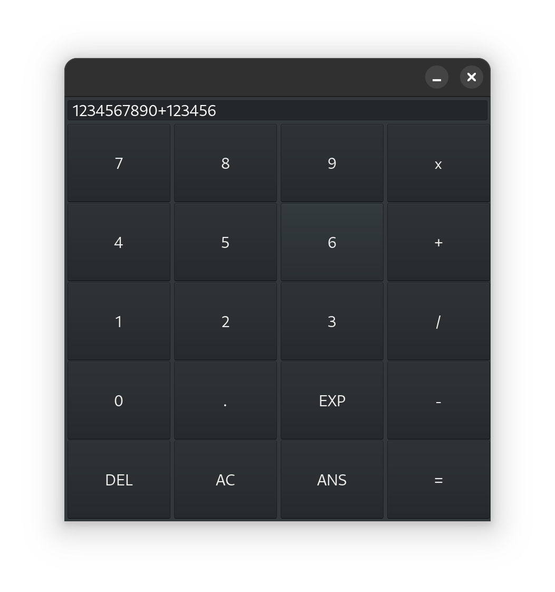

# HeloWorldWxWidgets

  

---

**[DotName C++ Template](https://github.com/tomasmark79/DotNameCppFree)** – Searching for a reliable solution for your CMake projects? This template 🛠️ offers a clean and scalable project structure, cross-platform compatibility, and adherence to modern C++ practices. Start building confidently! 🚀

## License

MIT License  
Copyright (c) 2024-2025 Tomáš Mark